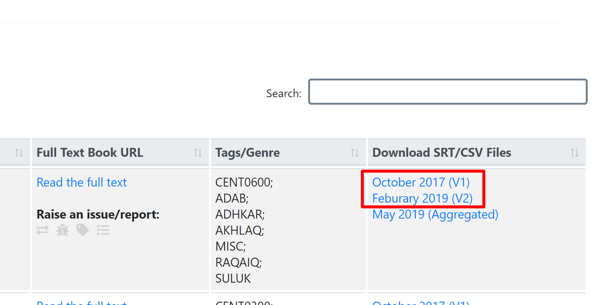
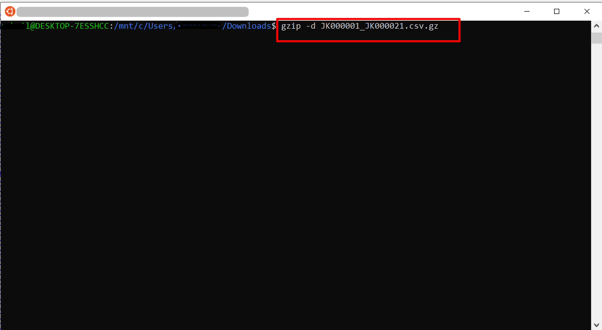
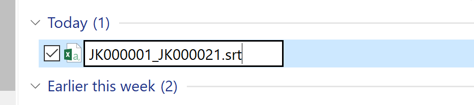
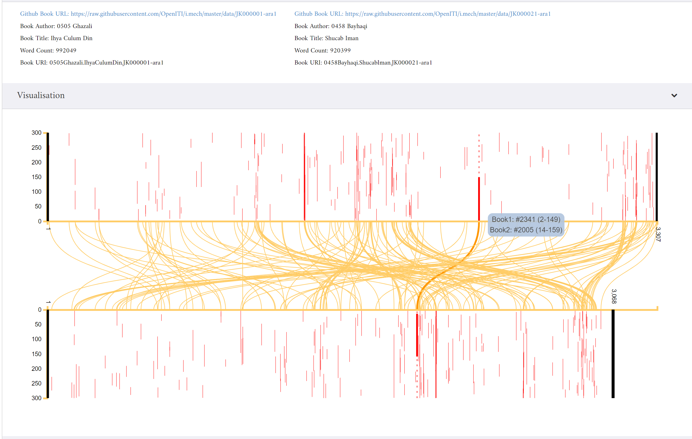
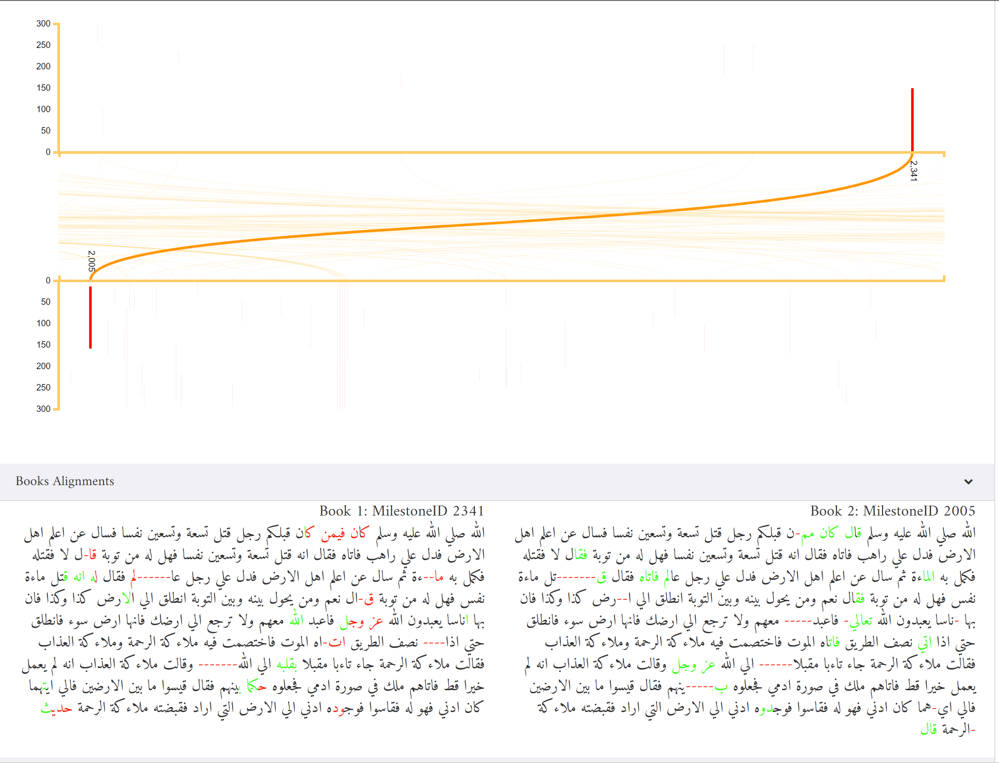

# KITAB Data Visualisation (v5) Tutorial

The visualisation application is accessible via this URL:
http://kitabapp-v5.azurewebsites.net/

By default the visualisation will load an alignment for Musnad Cumar Ibn Khattab(Shamela0026039)/Mustadrak(JK000467)

There are two different versions of alignment data available and the major difference between these alignments are related to how the outputs are organised (which has an implication on how visualisation read them).  There might be other difference e.g. passim ran with different params. 

#### STEP 1:

Search the book of interest via [KITAB / OPENITI Corpus Metadata Application].

Click the SRT Files (Version 2 link) and download the gz file

#### STEP 2:
The files are stored in the compressed format on the server which will need to be uncompressed before it can be uploaded to the visualisation application.  The following command (Linux/Bash) will ungz the file.

`gzip -d JK000001_JK001249.csv.gz`

Note for Version 2 files:
If you are using version 2 files, after the file is uncompressed into CSV format it will need to be ranamed to `.srt` before it could be uploaded.

#### STEP 3:

Browse the and load the srt file. This should load the visualisation depending on the size of the file it may take a few secs to load.

We can look select a specifc alignment by clicking the red/yellow line.  Currently the text is mechnically chunked (300 word), hence y axis is showing 300.

Under the alingment the full book text (to provide context) is available.

#### Disclaimer:
This is a prototype version of the KITAB visualisations and only used for experiment/testing purposes.  We aim to develop this further in the future and hope to provide a better user experience. Meanwhile, if you have any feedback or face any issues, please feel free to report via [GitHub]

[KITAB / OPENITI Corpus Metadata Application]:https://kitab-corpus-metadata.azurewebsites.net/kitab-version.html

[GitHub]:https://github.com/sohailmerchant/pairwise-v5/issues